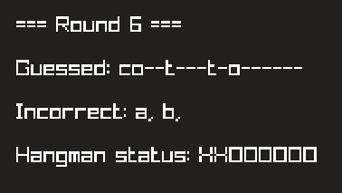

A simple hangman game written in C++

# Preview

# Key Features

-   [x] Export to CSV (in a version before GUI)
-   [ ] GUI
    -   [x] Working GUI
    -   [ ] GUI Improvements
        -   [ ] Put every .h and .cpp file except for main.cpp to a separate "src/model" directory
        -   [ ] Random word from a .txt file
        -   [ ] Export game results to a .csv file
        -   [ ] Display remaining attempts in a different way
-   [ ] Instant replay
-   [ ] Main menu with settings

# Sources

-   [Sample wordlist](https://www.mit.edu/~ecprice/wordlist.10000)
-   [Raylib template](https://github.com/educ8s/Raylib-CPP-Starter-Template-for-VSCODE-V2)
